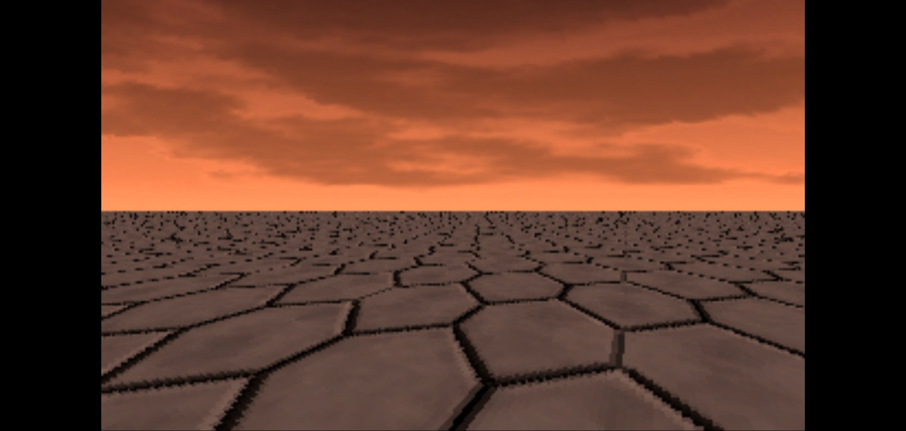

# JNIBitmaps

## About

In 2022 I made a very basic floor rasterizer in C with SDL and it worked really well... but even though it was "multiplatform", with support for Windows, Linux and MacOS, there was no easy way to port it just-as-is to Android.

That is why I decided to try interface the C source code of my rasterizer to Java through JNI - Java Native Interface, which Kotlin also uses, since JNI works closely with JVM and Kotlin on Android compiles to JVM bytecode.

The result is quite good, even better than original because I've bothered to add the skybox, which also has its own projection transformation before rasterizer, just like the floor plane.

## Code

### Bitmap manager

Bitmap manager is a bridge between JVM and native memory for rendering resources. What it does is it to take the `BitmapManager` class and convert bitmaps to C code structs for rasterizer usage. It basically allows the rasterizer to retrieve bitmaps as declared in Kotlin code.

### Rendering

Rendering, apart from the main rasterizer code, is not exposed to Kotlin at all. They are called from `main.c`, which contains JVM native functions for rasterizer initialization and render method.

Rasterizer operates on `AndroidBitmap` from Android SDK. It's one of the only ways for native code to write pixels onto Android Views.

